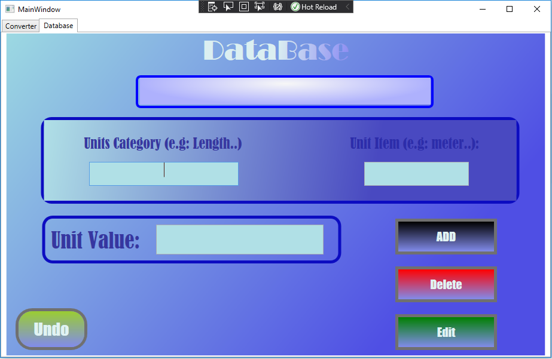

## Converter_with_Sql_Database.

#### the difference between this Repo and the other Converters Repos is that I changed the static data that the user uses when converting units to a SQL database.

#### MyConnection class is created to connect SQL database.

#### In the image below,  a new tab called "Database." has been added to the  Converter App UI. Three label fields for user information are included on the tab (Unit Category, Unit Name, and Value). The user will then have the option of selecting one of these processes (Edit the value of an existing Unit, Add and new Category or unit, and delete a specific unit or the whole category with all related units).

#### The database tab now has an undo button, giving users the option to undo any mistakes they made during previous operations.

##### The code provides conversions between units of length (meters, feet, inches), units of data (bits or bytes) and temperature (celsius , fahrenheit). However ,the  list of categories with unexist units could be easily extensible so that conversions of units of other measures (like volume - liter, cubicinch, pint) could be added by any user in the future. Also, the app supports commonly used SI prefixes.  

#### Text input with some kind of simplified syntax (ignore plural / singular difference for example).

